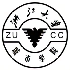
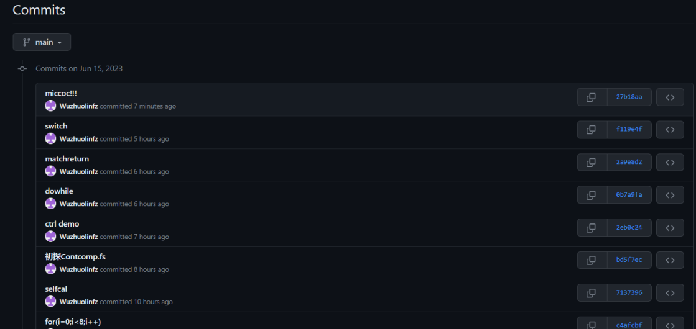
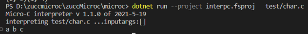
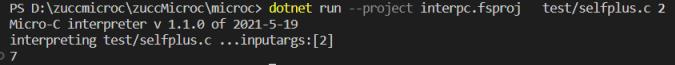
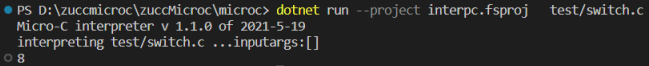
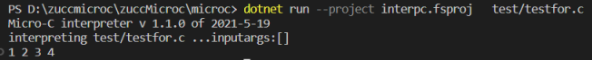
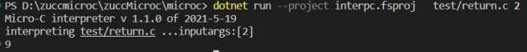
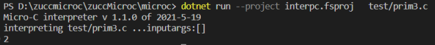

# 2020-2021学年第2学期
# **实 验 报 告**


- 课程名称:编程语言原理与编译
- 实验项目:期末大作业
- 专业班级_计算2002__                      
- 学生学号_32001080__                        
- 学生姓名_吴卓霖__                        
- 实验指导教师:郭鸣

## 实验内容


## 小组成员

| 姓名 |学号 |班级 |任务|权重|
| :----------- | :-----------: |  ---: |   ---: |   ---: |
| Name   |      No.     | Class |Task|Factor|
| 张魏忠|   32001230 | 计算机2002 |编码，测试|0.9|
| 吴卓霖|   32001080 | 计算机2002 |设计，编码|1.0|

 成员代码提交日志



1. 项目自评等级:(1-5)
请根据自己项目情况填写下表

| 词法                                       | 评分 | 备注 |      |
| ------------------------------------------ | ---- | ---- | ---- |
| char.float声明定义                  | 3  | float仅解释器实现,支持+-*/   |      |
| ++.--.+=.-=                           |  5   | C语言自增自减运算     |      |
| print                               |    2 |  c语言形式 ("%d",x)    |      |

| 语法                                       | 评分 | 备注 |      |
|------------------------------------------|--------|------|-----|
| switch-case                        |  3   | 仅解释器实现     |      |
| 循环  for / while / do while       |  5   |      |      |
| 修改环境变量break continue return          |   4   | 全局环境加入ctrl，编译器未实现 |      |
| return函数结果                            |   3   | 补解释器缺的     |      |
| 三目运算符?                            |   5   |      |      |


1. 项目说明

    - 简介： 项目是基于现有的plzoofs-master-microc代码

        解释器需要按照自己的思路设计词法分析器，语法分析器，以及变量定义，搭建框架等等。

            Absyn.fs抽象语法设计
            CLex.fsl词法分析
            Contcomp.fs编译器
            CPar.fsy语法分析
            interp.fs业务逻辑层
            interpc.fsproj解释器运行
            microcc.fsproj编译器运行
            StackMachine.fs堆栈指令

2. 解决技术要点说明
    - 定义声明(char.float.string)
      - 实现char、float、string的声明定义，
      ```f#
      //under Evaluating micro-C expressions
      | CstI i -> (i, store)
      | ConstChar c    -> ((int c), store)
      | ConstString s  -> (s.Length,store)
      | ConstFloat f ->
            //类型转换
           let bytes = System.BitConverter.GetBytes(float32(f))
           let v = System.BitConverter.ToInt32(bytes, 0)
         (v, store)
      ```
      test/char.c
      ```c
        char a;
        void main() {
        char b;
        char c='c';
        a='a';
        b='b';
        print("%c",a);
        print("%c",b);
        print("%c",c);
        }
      ```
      
    - print
      - 仿c语言格式,如：(print("%d",i))
      ```f#
        //under Evaluating micro-C expressions
        | Print (op , e1) ->    let (i1,store1) = 
                                eval e1 locEnv gloEnv store
                            let res = 
                                match op with
                                | "%c"   -> (printf "%c " (char i1); i1)
                                | "%d"   -> (printf "%d " i1; i1)  
                                | "%s"   -> (printf "%s " (string i1); i1)
                                | "%f"   -> (printf "%f " (float i1) ;i1)
                                | _ -> failwith ("unknown primitive " + op)  //Error info 
                            (res, store1)
      ```
    - ++.--.+=.-=
      - c语言自运算
      ```f#
        //Evaluating micro-C expressions
        | SimpleOpt (ope,acc,e) ->
        let  (loc, store1) = access acc locEnv gloEnv store // 取acc地址
        let  (i1)  = getSto store1 loc
        let  (i2, store2) = eval e locEnv gloEnv store
        let  res =
            match ope with
            | "Z++" -> i1 + i2
            | "++Z" -> i1 + i2
            | "Z--" -> i1 - i2
            | "--Z" -> i1 - i2
            | "+="  -> i1 + i2
            | "-="  -> i1 - i2
            | "*="  -> i1 * i2
            | "/="  -> i1 / i2
            | "%="  -> i1 % i2
            | _ -> failwith ("unknown primitive " + ope)
        (res, setSto store2 loc res)
      ```
      test/selfplus.c
      ```c
        void main(int n) {
        n++;
        print("%d",n+=4);
        
        }
      ```
      
    - controlStat
      - 全局环境中加入控制语法ctrl
      ```f#
        //undercircle
        match controlStat with
             | Some(Break)           -> (store1, None)          // 如果有遇到的break，结束该次循环并清除break标记
             | Some(Return _)        -> (store1, controlStat)   // 如果有未跳出的函数，
             | _      //  continue或者没有设置控制状态时，先检查条件然后继续运行
      ```
    - switch case
      - 选择
      ```f#
        //under exec
        | Switch (e,body) ->  
                let (res, store0) = eval e locEnv gloEnv store
                let rec loop store1 controlStat = 
                    match controlStat with
                    | Some(Break)           -> (store1, None)          // 如果有遇到的break，结束该次循环并清除break标记
                    | Some(Return _)        -> (store1, controlStat)   // 如果有未跳出的函数，
                    | _                     ->                         // continue或者没有设置控制状态时，先检查条件然后继续运行
                        let rec pick list =
                            match list with
                            | Case(e1,body1) :: tail -> 
                                let (res2, store2) = eval e1 locEnv gloEnv store1
                                if res2=res then exec body1 locEnv gloEnv store2 None
                                            else pick tail
                            | [] -> (store1,None)
                            | Default( body1 ) :: tail -> 
                                let (res3,store3) = exec body1 locEnv gloEnv store1 None
                                pick tail
                        (pick body)
                loop store0 controlStat
        | Case (e,body) -> exec body locEnv gloEnv store controlStat
      ```
      test/switch.c
      ```c
        void main() {
        int n=5;
        switch(n){
            case 1: n++;
            case 2: n--;
            case 5: n=n+3;
            case 8: n=1;
        }
        print n;
        }
      ```
      
    - for
      - 循环
      ```f#
        | For ( dec,e1,opera,body ) ->
        let (res , store0) = eval dec locEnv gloEnv store
        let rec loop store1 controlStat = 
             match controlStat with
             | Some(Break)           -> (store1, None)          // 如果有遇到的break，结束该次循环并清除break标记
             | Some(Return _)        -> (store1, controlStat)   // 如果有未跳出的函数，
             | _                     ->                         // continue或者没有设置控制状态时，先检查条件然后继续运行
                let (ifValue, store2) = eval e1 locEnv gloEnv store1
                if ifValue<>0 then 
                    let (store3,c) = exec body locEnv gloEnv store2 None
                    let (oneend ,store4) = eval opera locEnv gloEnv store3
                    loop store4 c
                        else (store2,None)
        loop store0 controlStat
      ```
      test/testfor.c
      ```c
        void main() {
        int n=5;
        int i;
        for (i = 1; i < n; i=i+1)
        {
            print("%d",i);
        }
        
        }
      ```
      
    - return(method)
      - 返回函数的值
      ```f#
        //under callfun
        match c with
        | Some(Return res)  -> 
            if res.IsSome then 
                let retVal = fst (eval res.Value locEnv gloEnv store3) in
                    (retVal, store3) 
            else (-111, store3) // interupt by return
        | _                 -> (-112, store3)  // end with normal stmt
      ```
      test/return.c
      ```c
        void main(int n) {
        int q;
        q = fun(n);
        print("%d",q);

        }

        int fun(int i){
        i=i+7;
        return i;
        }
      ```
      
    - ?
      - 三目运算符
      ```f#
        //under eval
        | Prim3 (e1, e2, e3) ->
        let (i1, store1) = eval e1 locEnv gloEnv store
        if i1 <> 0 then
            eval e2 locEnv gloEnv store1
        else
            eval e3 locEnv gloEnv store1
      ```
      test/prim3.c
      ```c
        void main() {
        int n=2;
        if(n ? 1:0){
            print("%d",n);
        }
        }
      ```
      
3. 心得体会（结合自己情况具体说明）

     - 大项目开发过程心得
        - 遇到哪些困难，经历哪里过程，有哪些收获
        - 。。。
        - 。。。
     - 本课程建议
         - 课程难度方面，进度方面，课程内容，授课方式等，给出你的意见
         - 。。。
         - 。。。
